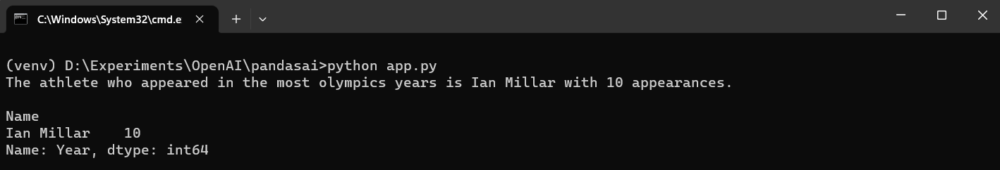

# PandasAI demos
PandasAI is a Python library that extends the functionality of Pandas by incorporating generative AI capabilities.

## Installation

```
pip install pandasai
```

## Sample code

### Example 1

```py
# Example 1

import pandas as pd
from pandasai import PandasAI
from pandasai.llm.openai import OpenAI

llm = OpenAI(api_token="YOUR_API_TOKEN")
pandas_ai = PandasAI(llm)

# Sample DataFrame
df = pd.DataFrame({
    "country": ["United States", "United Kingdom", "France", "Germany", "Italy", "Spain", "Canada", "Australia", "Japan", "China"],
    "gdp": [19294482071552, 2891615567872, 2411255037952, 3435817336832, 1745433788416, 1181205135360, 1607402389504, 1490967855104, 4380756541440, 14631844184064],
    "happiness_index": [6.94, 7.16, 6.66, 7.07, 6.38, 6.4, 7.23, 7.22, 5.87, 5.12]
})

result = pandas_ai(df, prompt='Which are the 5 happiest countries?')
print(result)
```

### Example 2

```py
# Example 2

import pandas as pd
from pandasai import PandasAI
from pandasai.llm.openai import OpenAI

llm = OpenAI(api_token="YOUR_API_TOKEN")
pandas_ai = PandasAI(llm)

# Sample DataFrame
df = pd.DataFrame({
    "country": ["United States", "United Kingdom", "France", "Germany", "Italy", "Spain", "Canada", "Australia", "Japan", "China"],
    "gdp": [19294482071552, 2891615567872, 2411255037952, 3435817336832, 1745433788416, 1181205135360, 1607402389504, 1490967855104, 4380756541440, 14631844184064],
    "happiness_index": [6.94, 7.16, 6.66, 7.07, 6.38, 6.4, 7.23, 7.22, 5.87, 5.12]
})

result = pandas_ai(df, prompt='Plot the histogram of countries showing for each the gdp, using different colors for each bar')
print(result)
```

### Example 3

```py
# Example 3

import pandas as pd
from pandasai import PandasAI
from pandasai.llm.openai import OpenAI

llm = OpenAI(api_token="YOUR_API_TOKEN")
pandas_ai = PandasAI(llm)

df = pd.read_csv("athlete_events.csv")
print(df.head())

print(pandas_ai.run(df, prompt='Which athlete appeared in the most olympics years and how many'))
print(df.groupby(by='Name')['Year'].nunique().sort_values(ascending=False).head(1))

print(pandas_ai.run(df, prompt='Which athlete has participated in the most number of events and how many'))

print(pandas_ai.run(df, prompt='Which country has won the highest number of medals and how many'))
print(df.groupby(by='NOC')['Medal'].count().sort_values(ascending=False).reset_index().head(1))

print(pandas_ai.run(df, prompt='Plot a barplot with the total number of medals won by participants from IND'))
```

## Demos





## Run the app
- Install the dependencies
```
pip install pandasai
```
- Run the `app.py` using the following command
```
python app.py
``` 

## How to Get OpenAI key ?
- Open platform.openai.com.
- Click on your name or icon option which is located on the top right corner of the page and select "API Keys" or click on the link - Account API Keys - OpenAI API.
- Click on create new secret key button to create a new openai key.